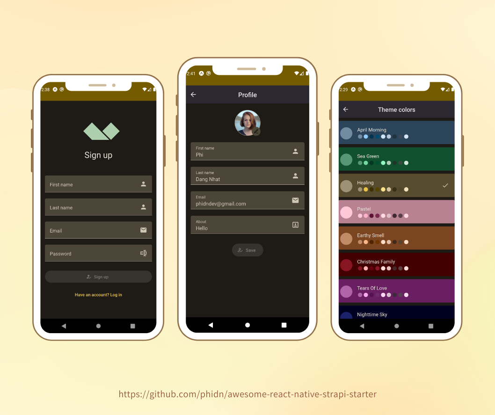

# React Native Starter

## Screenshots

## Build with
- React Native
- React Native Paper
- Redux Toolkit
- i18next
- Strapi (Back-end)

## Included Features:
- Login, Register, Forgot Password, Change Password, Change Profile (with Image)
- Validation with validatejs (production: 5.05KB minified and gzipped)
- Darkmode/Lightmode with AsyncStorage
- Basic Navigation with BottomTabNavigator and NativeStackNavigator
- SpashScreen

## Install
### Server
- Rename .env.example to .env and enter your key
- yarn && yarn develop

### Mobile
- Change baseUrl in config/api.js to your ngrok
- yarn android (yarn ios)

